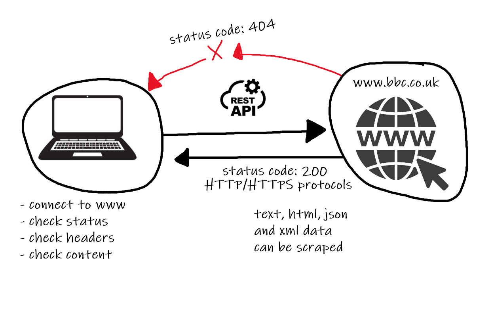

# Object Oriented Programming (OOP)

## Functions
Functions are used so that you 'Don't Repeat Yourself (DRY)'. 

We can create a function using `def <name>()`. And we call that function in main simply doing `<name>()`.
```python
def greeting():
    print('Hello from the greeting function!')

greeting()
```
```commandline
Hello from the greeting function!
```
We can call this function numerous times without rewriting the greeting message.
```python
def greeting():
    print('Hello from the greeting function!')

greeting()
greeting()
greeting()
greeting()
```
```commandline
Hello from the greeting function!
Hello from the greeting function!
Hello from the greeting function!
Hello from the greeting function!
```
Remark: If we enclose a function with `print()`, `None` is returned.
```python
def greeting():
    print('Hello from the greeting function!')

print(greeting())
```
```commandline
None
```
To solve this, we need to use `return` within the function.
```python
def greeting():
    return 'Hello from the greeting function!'

print(greeting())
```
```commandline
Hello from the greeting function!
```
Now we shall allow our functions to take in arguments (known as `args`) i.e., inputs.
```python
def greeting(name):
    return 'Hello {} from the greeting function!'.format(name)

print(greeting('Alice'))
```
```commandline
Hello Alice from the greeting function!
```

### Activity

Create a function to prompt the user to enter their name and display the name back to the user with a greeting message.

```python
def greeting(name):
    return 'Hello {} from the greeting function!'.format(name)

print(greeting(input('What\'s your name? ')))
```

### Using operators with functions
```python
def add(num1, num2):
    return num1 + num2


def multiply(num1, num2):
    return num1 * num2


print(add(1, 1))
print(multiply(3, 2))
```
```commandline
2
6
```
Remark: It is convention to separate functions with two empty lines.

Now we look at how functions cascade. The `return` exits out of the function before the print statement can be executed.
```python
def add(num1, num2):
    return num1 + num2
    print('Hello')

print(add(1, 1))
```
```commandline
2
```

## Python Modules and Packages
Find more information about available modules at [python.org](https://docs.python.org/3/).

We can add a module into our python file using `import`. In our example, I will use the `math` module.
```python
import math
```
Lets us it!
```python
import math

num = 23.44

print(math.ceil(num))
print(math.floor(num))

print(math.pi)
```
```commandline
24
23
3.141592653589793
```
Another common module is the `random` module.
```python
import random

print(random.random())
```
```commandline
0.3045713410944838
```
This will print a random normalised 16-decimal-placed real number. 

We can also use `from` to import differently, so we don't need to name the module everytime we call it.
```python
from random import random

print(random())
```

Now we shall use `import os` and `import sys` to check system specific information for Windows OS.
```python
print(os.getcwd())  # returns current folder path of file
```
```commandline
C:\Users\Ahhhh-man\PycharmProjects\eng89_object_orientated_programming
```
Let use another, check the date using `datetime`.
```python
import datetime
print(datetime.date.today())
```
```commandline
2021-06-24
```
One more. Use `request` to interact with live API. Firstly we need to install this package in the terminal using `pip install requests`. `pip` is a package manager in python to install any dependencies.
```python
import requests
```
This should yield no errors.

Let's look at API.



```python
import requests
requests_api = requests.get("https://www.bbc.co.uk/")
print(requests_api.status_code)
```
```commandline
200
```
The possible outputs for status code are:
- 200 for success
- 404 for error/failure or above

We can also get specific information from the API.
```python
print(requests_api.headers)
print(requests_api.content)
```

## Four Pillars of OOP

- Abstraction
- Inheritance
- Encapsulation
- Polymorphism 

## Steps
1. Create an animal.py file to create root parent class
2. Create reptile.py to abstract data and inherent from animal.py
3. Create snake.py 
4. Create python.py; and now should be able to utilise inheritance from multiple classes, that is, from animal.py to python.py


### Step 1
```python
class Animal:
    # we need to initialise with built-in method called `__init__(self)`
    # `self` refers to current file

    def __init__(self):  # we declare attributes in our init method
        self.alive = True
        self.spine = True
        self.eyes = True
        self.lungs = True

    def breathe(self):
        return 'Animals must keep breathing.'

    def eat(self):
        return 'Animals must keep eating.'

    def move(self):
        return 'Animals must keep moving.'


# we need to create an object of this class in order to use any methods
cat = Animal()

print(cat.breathe())
print(cat.eat())
print(cat.move())
```
```commandline
Animals must keep breathing.
Animals must keep eating.
Animals must keep moving.
```
### Step 2
```python
from steps.animal import Animal


class Reptile(Animal):
    def __init__(self):
        super().__init__()  # `super` is used to inherit everything from parent class
        self.cold_blooded = True
        self.tetrapods = None
        self.heart_chamber = [3, 4]

    def seek_heat(self):
        return 'This Reptile is seeking heat.'

    def hunt(self):
        return 'This Reptile is hunting.'

    def use_venom(self):
        return 'This Reptile is venomous.'


# Creating an object of this Reptile class
lizard = Reptile()

print(lizard.seek_heat())
print(lizard.hunt())
print(lizard.use_venom())
# but we can also use animal methods via inheritance
print(lizard.breathe())
print(lizard.eat())
print(lizard.move())
```
```commandline
This Reptile is seeking heat.
This Reptile is hunting.
This Reptile is venomous.
Animals must keep breathing.
Animals must keep eating.
Animals must keep moving.
```
### Step 3

```python
from steps.reptile import Reptile


class Snake(Reptile):
    def __init__(self):
        super().__init__()
        self.forked_tongue = True

    def use_tongue_to_smell(self):
        return 'Snakes use their tongues to smell.'


viper = Snake()

print(viper.use_tongue_to_smell())
print(viper.use_venom())
print(viper.hunt())
```
```commandline
Snakes use their tongues to smell.
This Reptile is venomous.
This Reptile is hunting.
```

### Step 4

```python
from steps.snake import Snake


class Python(Snake):
    def __init__(self):
        super().__init__()
        self.large = True
        self.two_lungs = True

    def digest_large_prey(self):
        return 'A python can digest large animals.'

    def climb(self):
        return 'A python can climb.'

    def __shed_skin(self):
        return 'A python can shed its skin.'


python = Python()

print(python.digest_large_prey())
print(python.use_tongue_to_smell())
print(python.use_venom())
print(python.hunt())

# print(python.__shed_skin())
```

## Refactor Tasks with Classes
### Task 1: Calculator

### Summary

Amazing you now know functions, lets make a functional calculator.

### Tasks

* Complete the core tasks

```python
# Create a class called Calculator
# functions
# practice using, defining and calling functions

# Build a basic functional
# Core 1: build function containing
    # add,
    # subtract,
    # multiply,
    # divide.

# Create a file for child class called Functional_calculator
# import calculator class and inherit all the functionality 
# Core 2: Build more functions for
    # area of a circle
    # area of a square
    # area of a triangle (just find the easiest way)
```

```python
class Calculator:
    def add(self, num1, num2):
        return num1 + num2

    def subtract(self, num1, num2):
        return num1 - num2

    def multiply(self, num1, num2):
        return num1 * num2

    def divide(self, num1, num2):
        return num1 / num2


# calculation = Calculator()
#
# print(calculation.add(10,5))
# print(calculation.subtract(10,5))
# print(calculation.multiply(10,5))
# print(calculation.divide(10,5))
```

```python
from calculator import Calculator
import math

class FunctionalCalculator(Calculator):
    def __init__(self):
        super().__init__()

    def area_of_circle(self, num1):
        return math.pi * (num1 ** 2)

    def area_of_square(self, num1, num2):
        return self.multiply(num1, num2)

    def area_of_triangle(self, num1, num2):
        return .5 * self.multiply(num1, num2)

# calc = FunctionalCalculator()
#
# print(calc.area_of_circle(5))
# print(calc.area_of_square(5, 10))
# print(calc.area_of_triangle(5, 10))

```


## Task 2: Age and Permission

### Summary

Simple program to use control flow!

### Tasks

* rules of what the program to do are followed, see bellow

Starter code
```
age = 19
driver_license = True

# - You can vote and driver
# - You can vote
# - You can driver
# - you can't legally drink but your mates/unties might have your back (bigger 16)
# - Your too young, go back to school!
#  as a user I should be able to keep being prompted for input until I say 'exit'
```

## Acceptance Criteria
* class created with required function/s 
* is a program that run continuously
* handles strings and integers
* has exit condition
* all business logic works

```python
class User:
    def __init__(self, age, driver_license):
        self.age = age
        self.driver_license = driver_license

    def can_vote(self):
        if self.age >= 16:
            return 'You are over 16 so can legally vote!'
        else:
            return 'You are under 16 so can\'t legally vote!'

    def can_drive(self):
        if self.driver_license and self.age >= 18:
            return 'You are over 18 so can legally drive!'
        else:
            return 'You are under 18 so can\'t legally drive!'

    def can_drink(self):
        if self.age < 18:
            return "You can't legally drink but your mates/unties might have your back (bigger 16)"
        else:
            return "You are over 18 so can legally drink!"

    def check_student(self):
        if self.age < 18:
            return "Your too young, go back to school!"
        else:
            return "Aah the school-free life. Now go find some work!"


# age = 19
# driver_license = True

while True:
    age = input('What\'s your age? ')
    if age.lower() == 'exit':
        exit()
    while not age.isdigit():
        print('Invalid Input. Try again.')
        age = input('What\'s your age? ')

    response = input('Do you have a driver\'s license? (y/n) ')
    if response.lower() == 'y':
        driver_license = True
        break
    elif response.lower() == 'n':
        driver_license = False
        break
    elif response.lower() == 'exit':
        exit()
    else:
        print('Invalid Input. Try again')

person = User(int(age), driver_license)

print(person.can_vote())
print(person.can_drive())
print(person.can_drink())
print(person.check_student())
```

