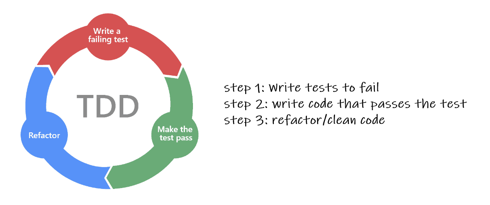

# Test Driven Deployment (TDD)

## What is TDD?
Test driven development (TDD) is a software development technique that relies on the requirements of software to be converted to tests prior to complete creation of software. All software is tracked by software testing in all test cases frequently.
This is against first developing software and subsequently creating test cases. 



## Activity 
1. Create python repo called `python_TDD`.
2. Create a new project on PyCharm with same name.
3. Create a test file called `calc_test.py`.
   - We will use `unittest` and `pytest` 
   - Install pytest via `pip install pytest`
   - Use `python -m pytest` in the terminal to check test cases
   - `python -m unittest discover -v`
4. Create file called `calc.py` to write code to pass the test.

## Solution
#### calc_test.py
```python
import unittest
import pytest

from calc import SimpleCalc


class CalcTest(unittest.TestCase):
    calc = SimpleCalc()

    # assertions to write our test cases
    # we will use our basic calc. example to write the test first then the code

    def test_add(self):
        self.assertEqual(self.calc.add(3, 2), 5)  # if True, test would pass, else False

    def test_subtract(self):
        self.assertEqual(self.calc.subtract(3, 2), 1)

    def test_multi(self):
        self.assertEqual(self.calc.multi(2, 2), 4)

    def test_divide(self):
        self.assertEqual(self.calc.divide(6, 3), 2)
```
#### simple_calc.py
```python
class SimpleCalc:
    def add(self, num1, num2):
        return num1 + num2

    def subtract(self, num1, num2):
        return num1 - num2

    def multi(self, num1, num2):
        return num1 * num2

    def divide(self, num1, num2):
        return num1 / num2
```
When we `run 'Unittests for calc_test'` by right-click options or `python -m pytest` in terminal, we get
```commandline
Testing started at 13:42 ...
Launching unittests with arguments python -m unittest calc_test.CalcTest in C:\Users\Ahhhh-man\PycharmProjects\python_TDD


Ran 4 tests in 0.002s

OK
```